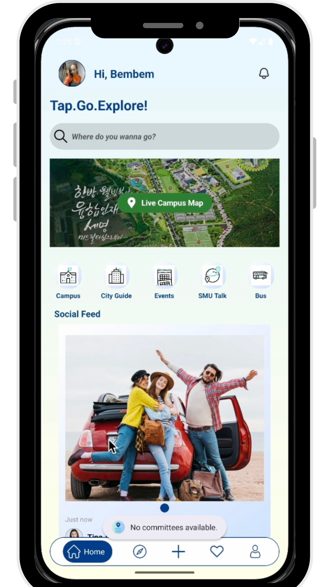
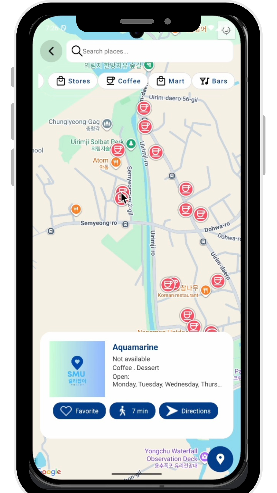
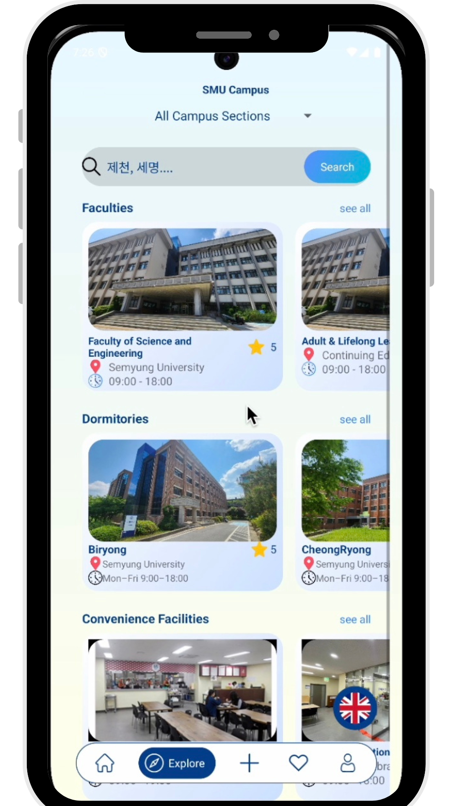
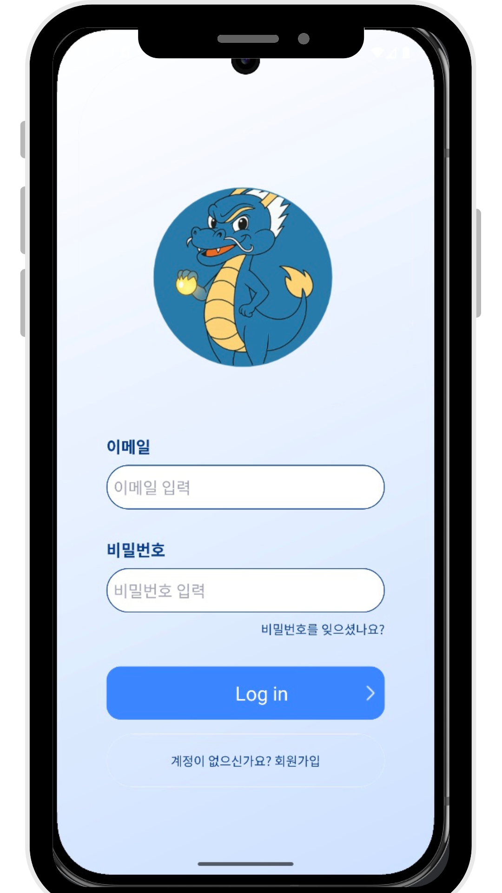
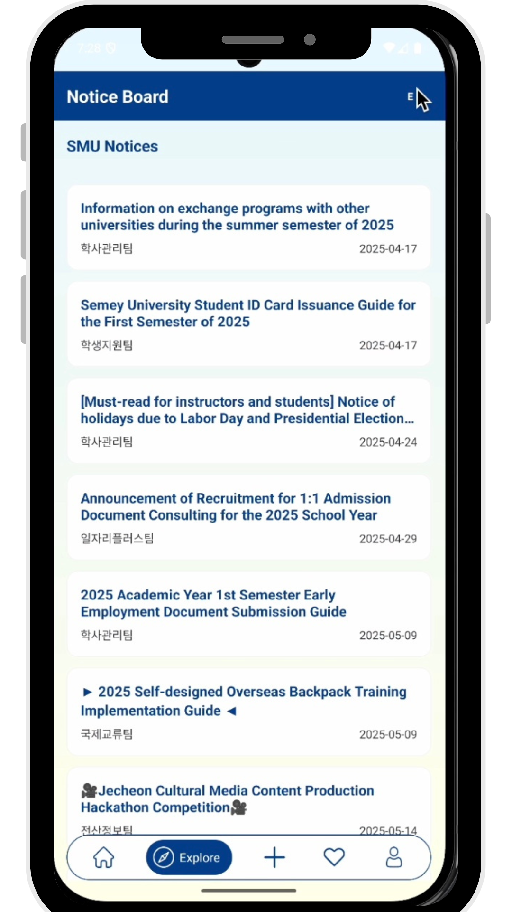
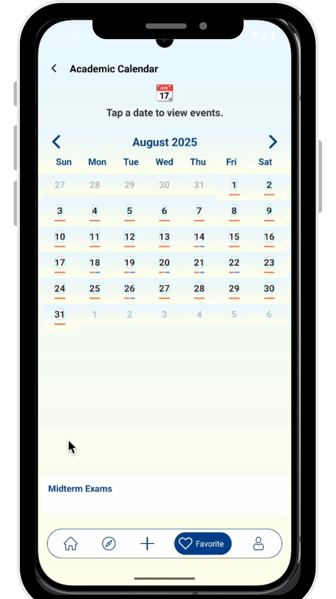

# SMU Navigator 📍

**SMU Navigator** is a **bilingual Android mobile application (Korean/English)** built to help students and visitors navigate **Semyung University** and explore nearby places in **Jecheon, South Korea**.

> Status: **Development / Testing (Pre-release)**  
> Role: **Team Leader** (Capstone Team Project)

---

## ✨ Key Features

- **Bilingual UI (KO/EN)** for local and international users
- **Campus & City Navigation** with categorized locations
- **Google Maps integration** (markers, navigation-style browsing)
- **Category-based filtering** (e.g., faculties, dorms, stores, cafes)
- **User Authentication & Profile** (Firebase Authentication)
- **Realtime Data Updates** (Firebase Realtime Database)
- **Media Storage** (Firebase Storage)

---

## Tech Stack

- **Android**: Java
- **Backend / Data**: Firebase Authentication, Realtime Database, Storage
- **Maps**: Google Maps API / Places API
- **UI**: XML Layouts, Material Design Components
- **Version Control**: Git, GitHub
- **Architecture**: Activity-based navigation, ViewModel (MVVM where applicable)

---

## App Screenshots

- Demo Video: 

---

##  Conference Paper & Poster Presentation (MITA International Conference2025)

This mobile application project was extended into a **research write-up** and submitted as a **conference abstract/paper**, **accepted**, and presented in a **poster session** at an international academic conference in **2025**.

- **No awards are claimed**
- **Conference attendance certificate** available as proof
- Poster/abstract materials available upon request
